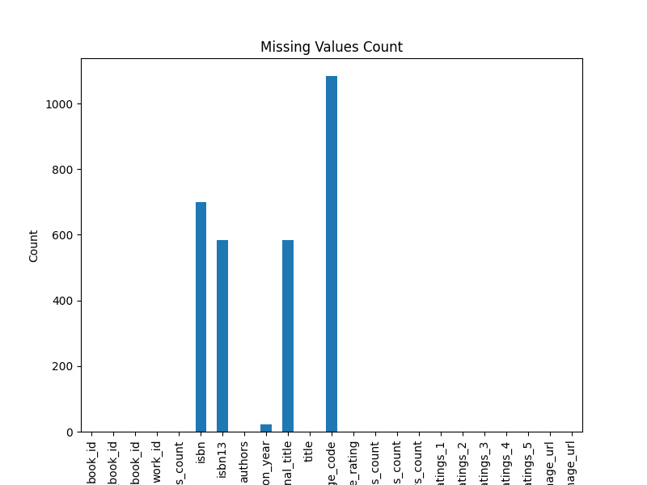

# Data Analysis Report

### Unveiling the Literary Landscape: Analyzing a Comprehensive Book Dataset

In an era where literature beautifully intertwines with data, we delve into a fascinating dataset encompassing 10,000 books, rich with 23 features illuminating the literary domain. The dataset offers a myriad of insights into aspects such as ratings, authors, publication years, and more, crucial for understanding reader engagement and book popularity. Among the standout features are:

- **Average Rating:** A mean value of 4.00 suggests a generally favorable reception of the works.
- **Authors:** 4,664 unique authors contribute to this dataset, with Stephen King leading as the most prolific, having 60 books represented.
- **Language Codes:** The majority of books are found in English, indicating a strong preference, but also an opportunity to explore literature in other languages.

### Missing Values: Implications and Observations

Despite the richness of the dataset, it contains noteworthy missing values. Specifically, the **ISBN** and **ISBN13** fields lack over 700 entries, making data retrieval for these titles challenging. Moreover, the language code is absent for 1,084 entries, which may skew insights related to reading demographics and trends. The absence of 21 entries in the **original_publication_year** could hinder chronological analyses of trends�crucial for understanding how tastes evolve over time. Addressing these gaps is essential, particularly for accurate data-driven decisions.

### Summary Statistics: Insights and Discoveries

The summary statistics paint a vivid picture of the dataset's nature:

- The **average rating** of 4.00, accompanied by a modest standard deviation of 0.25, indicates the majority of books maintain consistent approval ratings.
- The **ratings_count** averages over 54,000, with a max of nearly 4.8 million, suggesting a small percentage of highly popular titles significantly impact the average.
- The **books_count** reveals an outlier with the highest value of 3,455�an indication of a prolific author or series that deserves further investigation.

Of particular interest is the **original_publication_year**, which showcases a mean year of 1982. This suggests a sizeable collection of contemporary titles, but the presence of works dating as far back as 1750 hints that classics still hold sway over modern readership.

### Outliers: What Do They Indicate?

The analysis identified **470 outliers**, primarily clustered around ratings and reviews. This phenomenon reveals a dichotomy in reader engagement: a handful of books amass significant acclaim, while several fail to resonate. Understanding these outliers is essential, as they may reveal trends in marketing strategies, thematic originality, or shifts in consumer taste that traditional analyses might overlook. The top-rated titles often fall in genres like fantasy and fiction, attracting millions of ratings. Conversely, outliers with exceedingly low ratings could signify either niche appeal or shortcomings in execution.

### Conclusion: Key Insights and Future Actions

Our analysis of this literary dataset presents a diverse array of insights that can guide quality improvements and strategies for authors, publishers, and marketers:

1. **Address Missing Data:** Prioritize rectifying missing ISBN entries and language codes to bolster the dataset's integrity, enabling more robust analyses.

2. **Focus on High Engagement Titles:** Leverage insights from high-rating outliers to inform market strategies for promotions and new releases, capitalizing on themes and styles that resonate with readers.

3. **Explore Rare Authors and Genres:** Investigate authors with mid-range success alongside genre trends to discover potential for diversification, especially in translating less represented languages.

4. **Track Temporal Trends:** Analyze how ratings and publication years correlate to detect patterns, informing future releases and catering to shifting reader preferences.

This dataset is not just numbers; it offers a narrative of our literary tastes and preferences, a story that can guide us toward a more profound understanding of the world of books. By capitalizing on these insights, stakeholders can foster a more enriching reading experience for all.

