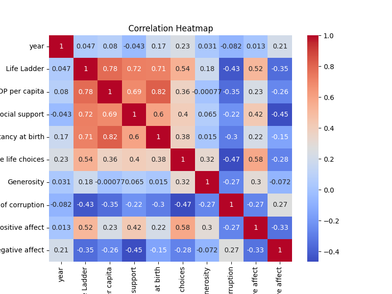
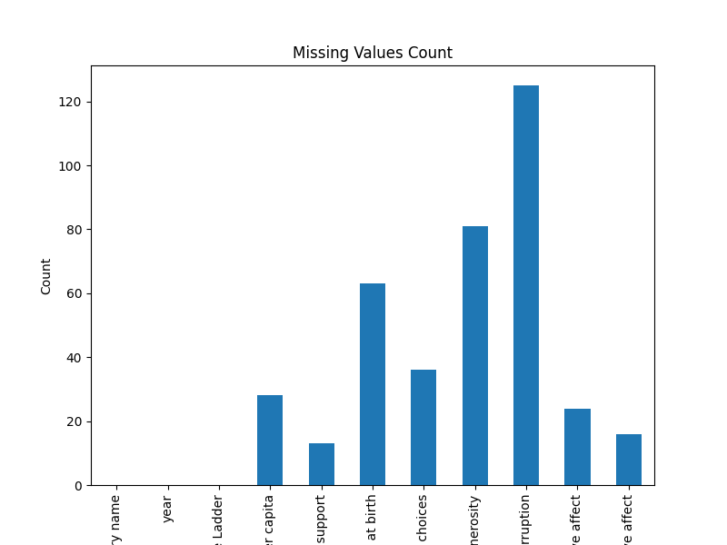

# Data Analysis Report

### Insights from the Global Happiness and Well-Being Dataset

#### Introduction

In our exploration of a comprehensive dataset focusing on global happiness and well-being, we find valuable insights spanning 2363 observations across 11 variables. This dataset captures essential elements such as Life Ladder scores, which reflect subjective well-being, and various socio-economic indicators like Log GDP per capita and perceived corruption. With countries represented from every corner of the globe, the dataset holds the potential to uncover patterns that can drive social improvements and policy-making.

#### Missing Values Impact

A notable aspect of this dataset is the presence of missing values across several key variables. While "Country name" and "year" are completely accounted for, variables like Log GDP per capita (28 missing), Social support (13 missing), and particularly Generosity (81 missing) may skew our analyses of how economic factors parallel happiness scores. This absence of data can impact our understanding of how various parameters influence overall well-being and requires careful consideration to avoid biases in interpretation.

#### Summary Statistics Highlights

The summary statistics reveal intriguing trends. On average, people rate their life satisfaction with a Life Ladder score of 5.48, indicative of a moderate level of happiness globally. Wealth, as quantified by Log GDP per capita, averages around 9.40, linking economic prosperity to well-being. Interestingly, we see that the mean for Social Support sits at 0.81, suggesting that individuals generally feel supported socially, a critical component for mental health.

However, the variable indicating Generosity tells a different story, averaging a meager 0.0001, implying that altruism may not be as high as desired across regions. Furthermore, the Perceptions of Corruption mean of 0.74 suggests a prevalent sentiment of distrust in institutions, which could undermine well-being. 

#### Outlier Analysis

Among the 2363 data points, 105 outliers have been detected. These outliers are particularly interesting and warrant further investigation. For instance, exceptionally high Life Ladder scores could correspond with countries that have strategic social policies or unique cultural factors enhancing happiness. Conversely, low scores might reveal distressing conditions in some populations, perhaps in areas undergoing conflict or political unrest. Understanding these outliers can be essential for addressing extreme cases and tailoring interventions to specific national contexts, revealing hidden needs that broader averages might overlook.

#### Conclusions and Actionable Insights

This analysis provides several key insights:

1. **Integration of Economic and Psychological Well-Being**: An actionable strategy is to couple economic development programs with initiatives that enhance social support systems, as both elements appear critically linked to overall happiness.

2. **Addressing Generosity and Corruption**: Policymakers should invest in campaigns aimed at building trust in institutions and fostering a culture of generosity. This could lead to improved perceptions of community and bolster citizen engagement.

3. **Further Research on Outliers**: A deeper exploration of the outlier cases could yield specific strategies for areas of concern or success stories that could be replicated elsewhere.

4. **Data Completeness**: To fortify future analyses, enhancing data collection methods to minimize missing values, particularly in critical happiness determinants, would be beneficial.

In essence, the global happiness and well-being dataset paints a multifaceted picture of how economic and social factors interplay to shape life satisfaction. As we move forward, emphasizing holistic approaches that balance economic growth with social cohesion will be vital in nurturing happier societies.

