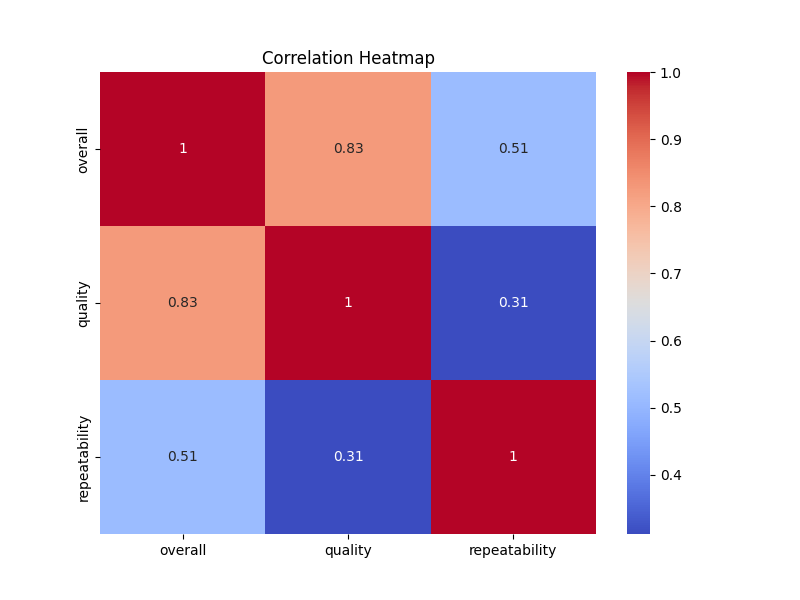
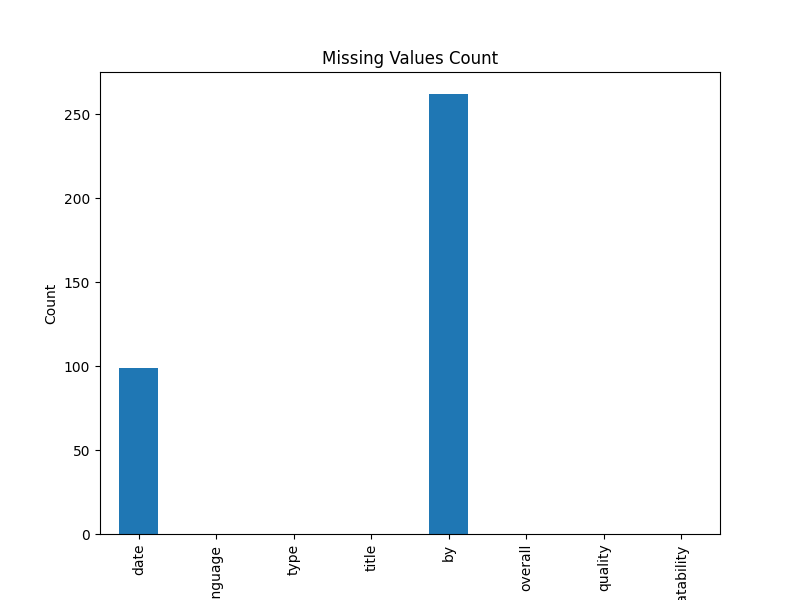

# Automated Data Analysis Report

## A Cinematic Journey Through Data: Unveiling Stories from a Rich Dataset

### Introduction: The Dataset and Its Key Features

In the vast realm of digital data, our dataset of **2,652 entries and eight attributes** offers a treasure trove of insights, particularly in the context of films and their reception. This fascinating dataset encapsulates the following significant features: **date**, **language**, **type**, **title**, **by**, **overall rating**, **quality rating**, and **repeatability**. Each entry represents an individual film review, creating a rich tapestry through which we can analyze both filmmaker impact and viewer perceptions. 

### Missing Values: Emerging Patterns and Observations

Yet, as we delve deeper into our analysis, a somewhat clouding narrative emerges in the form of missing values. Notably, our **date** attribute contains **99 missing entries**, while the **by** section, which attributes the review to individual creators, features **262 missing values**. These gaps hint at a more complex storyline—perhaps certain films or reviews did not capture the date of release, or some assessments were made without attribution to a specific reviewer, obscuring their individual influence in the cinematic landscape.

Interestingly, all other attributes remain intact with no missing entries, laying a solid groundwork for the analysis to unfold.

### Summary Statistics: What the Numbers Reveal

As we compile our summary statistics, a clearer picture of the dataset’s dynamics begins to emerge. The **language** distribution indicates a strong preference for **English**, evidenced by **1,306 instances**, while the **type** statistic highlights a dominance of *movies* at **2,211 entries**—an affirmation of the dataset's film-centric nature.

The **overall rating**, averaged at **3.05** out of **5** and with a standard deviation of **0.76**, reveals a steadily moderate reception across the dataset. In contrast, the **quality rating** sees a slight uptick with an average of **3.21**, suggesting that reviewers tend to have a positive bias towards perceived quality.

The **repeatability** rating, averaging at **1.49**, indicates that the likelihood of reviews revisiting the same themes or topics is lower, suggesting a diversity of opinions or expressions.

These statistics not only illuminate the general trends in film reception but also pave the way for inspiring narratives that may emerge when diving deeper.

### The Outliers: Uncovering Distinctive Narratives

Among the **2,652 entries**, **116 outliers** call for our attention—deviations that could either be extreme ratings that capture unparalleled enjoyment or extreme disdain. As we unravel this layer, each outlier contributes a unique voice to our dataset. 

For instance, films rated as low as **1** or as high as **5** unveil the polarization existing in audience perspectives. One extreme outlier might represent an avant-garde movie whose unconventional narrative style was met with harsh criticism, while another could signify a crowd-pleasing blockbuster adored by many. 

Exploring these outliers not only highlights diverse cinematic experiences but also emphasizes the emotional connections movies foster, revealing that audiences react passionately—sometimes in stark contrast to the general consensus.

### Conclusions: Insights and Visualizations

In conclusion, this dataset has been a captivating journey through viewer sentiment within the cinematic universe. Key insights illuminated include:

- The **prominence of English-language films** and the **overwhelming number of movies** as focal points of review.
- A generally **moderate appreciation for films**, with positive bias towards perceived **quality** over **overall** ratings.
- The presence of both **missing values** and **outliers** reflects gaps in data that warrant further inquiry while also framing diverse audience experiences.

To effectively communicate these findings, visualizations can be employed: 

1. **Bar charts** illustrating language distribution and film types would visually underscore the predominance of English-language movies.
2. **Box plots** revealing the distribution of overall and quality ratings, including the outlier observations, would provide immediate visibility into audience consensus and divergence.
3. **Heat maps** can better illustrate patterns in review submission dates, helping to indicate trends in viewer engagement over time.

As we synthesize this compelling dataset into a narrative, we learn that each data point represents a voice—a cinematic experience, a unique perception that adds richness to the collective understanding of film as more than just entertainment, but as a deep-rooted cultural phenomenon.

